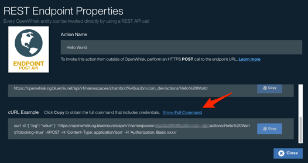

# OpenWhisk Integration

To obtain the token needed for configuration you can go to the [OpenWhisk Home](https://new-console.ng.bluemix.net/openwhisk/) and select the _Develop_ button to open the Editor.

On any of your actions select the __View REST Endpoint__ selection in the bottom right corner.

In the REST Endpoint view scroll down to view the full command as shown below.

The token value necessary for the can be found in the Authorization Header. *Note: Do not include Basic.*

